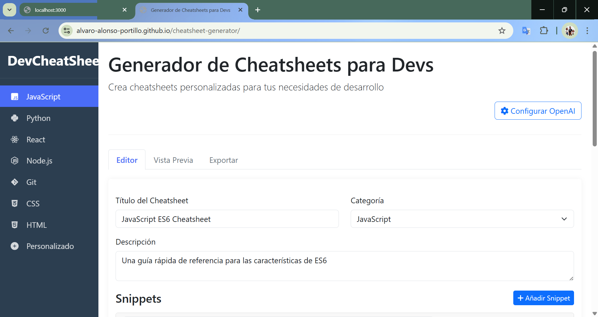

# DevCheatSheet Generator

 
 

## 📋 Descripción

DevCheatSheet Generator es una aplicación web que permite a los desarrolladores crear, personalizar y exportar cheatsheets de referencia para diferentes lenguajes de programación y tecnologías. Esta herramienta es ideal para mantener snippets de código organizados y accesibles, con explicaciones detalladas que pueden generarse automáticamente mediante la integración con OpenAI.

## ✨ Características

### 🖥️ Interfaz Interactiva
- Sidebar para seleccionar diferentes categorías de cheatsheets
- Sistema de pestañas para navegar entre Editor, Vista Previa y Exportación
- Diseño responsivo y atractivo usando Bootstrap

### 📝 Generación de Cheatsheets Personalizadas
- Editor para crear y editar snippets de código con títulos y explicaciones
- Soporte para múltiples lenguajes de programación con resaltado de sintaxis
- Sistema de guardado local para mantener tus cheatsheets

### 📤 Opciones de Exportación
- Exportación a PDF con diferentes tamaños de papel
- Exportación a HTML para compartir en web
- Exportación a Markdown para usar en GitHub o documentación
- Diferentes temas visuales (claro, oscuro, colorido, minimalista)

### 🤖 Integración con OpenAI
- Funcionalidad para generar explicaciones automáticas de snippets
- Interfaz para configurar tu API key de OpenAI
- Sistema de caché para optimizar las llamadas a la API

## 🚀 Demo

[Ver Demo en vivo](https://tu-usuario.github.io/devcheatsheet-generator) 



## 🛠️ Tecnologías Utilizadas

- HTML5, CSS3 y JavaScript (ES6+)
- Bootstrap 5 para el diseño responsivo
- Highlight.js para el resaltado de sintaxis de código
- html2canvas y jsPDF para la exportación a PDF
- LocalStorage para el guardado de datos
- API de OpenAI para la generación de explicaciones

## 📦 Instalación

1. Clona este repositorio:
   ```bash
   git clone https://github.com/Alvaro-Alonso-Portillo/devcheatsheet-generator.git
2. Navega al directorio del proyecto:
    ```bash
    cd devcheatsheet-generator
3. Abre en tu navegador o usa un servidor local:index.html

### Si tienes Python instalado:
    ```bash
    python -m http.server
    ```


### Si tienes Node.js instalado:
    ```bash
    npx serve
    ```

## 🔧 Uso:

-Crear una nueva hoja de trucos
-Selecciona una categoría en el sidebar
-Completa el título y la descripción
-Añade snippets de código usando el botón "Añadir Snippet"
-Para cada fragmento, proporciona un título, código y explicación
-Haz clic en "Guardar Cheatsheet" para guardar localmente
-Generar explicaciones con IA
-Configura tu API key de OpenAI haciendo clic en "Configurar OpenAI"
-Escribe o pega tu código en el editor
-Haz clic en "Generar con IA" para obtener una explicación automática
-Exportar hojas de trucos
-Navega a la pestaña "Exportar"
-Selecciona el formato deseado (PDF, HTML, Markdown)
-Configura las opciones de exportación
-Haz clic en "Exportar" para descargar tu hoja de trucos

## 🤝 Contribuir
Las contribuciones son bienvenidas. Si deseas mejorar esta aplicación, puedes:
Hacer fork del repositorio
Crear una rama para tu característica (git checkout -b feature/amazing-feature)
Hacer commit de tus cambios (git commit -m 'Add some amazing feature')
Hacer push a la rama (git push origin feature/amazing-feature)
Abrir un Pull Request
## 📄 Licencia
Distribuido bajo la Licencia MIT. Ver para más información.LICENSE
## 🙏 Agradecimientos
Bootstrap
Highlight.js
Fuente impresionante
IA abierta
html2canvas
jsPDF